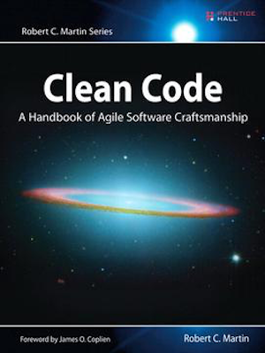

[](https://gitpitch.com/enogrob/ebook-project/master)
```
Roberto Nogueira  
BSd EE, MSd CE
Solution Integrator Experienced - Certified by Ericsson
```
# eBook Clean Code



**About**

Learn everything you need to about the subject of this `eBook` project.

[Homepage](https://www.safaribooksonline.com/library/view/clean-code/9780136083238/)

## Topics
```
[ ] Introduction
[ ] Acknowledgments
[ ] Chapter 1: Clean Code
[ ] Chapter 2: Meaningful Names
[ ] Chapter 3: Functions
[ ] Chapter 4: Comments
[ ] Chapter 5: Formatting
[ ] Chapter 6: Objects and Data Structures
[ ] Chapter 7: Error Handling
[ ] Chapter 8: Boundaries
[ ] Chapter 9: Unit Tests
[ ] Chapter 10: Classes
[ ] Chapter 11: Systems
[ ] Chapter 12: Emergence
[ ] Chapter 13: Concurrency
[ ] Chapter 14: Successive Refinement
[ ] Chapter 15: JUnit Internals
[ ] Chapter 16: Refactoring SerialDate
[ ] Chapter 17: Smells and Heuristics
[ ] Appendix A: Concurrency II
[ ] Appendix B: org.jfree.date.SerialDate
[ ] Appendix C: Cross References of Heuristics
[ ] Epilogue
[ ] Index
```
